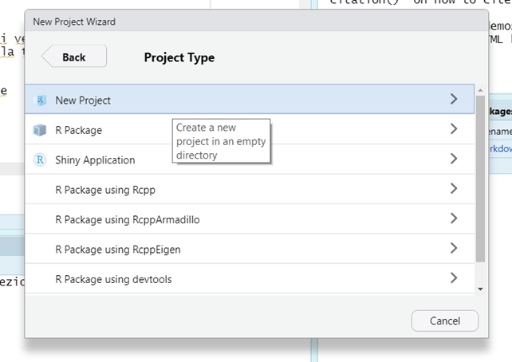

```{r setup, include=FALSE}
knitr::opts_chunk$set(echo = T, 
                      warning = F, 
                      message = F, 
                      fig.align = "center", 
                      out.width = "90%", 
                      class.output="scroll-100")
hook_output <- knitr::knit_hooks$get("output")

knitr::knit_hooks$set(output = function(x, options) {
  if (!is.null(n <- options$out.lines)) {
    x <- xfun::split_lines(x)
    if (length(x) > n) {
      # truncate the output
      x <- c(head(x, n), "....\n")
    }
    x <- paste(x, collapse = "\n")
  }
  hook_output(x, options)
})
library(TAM)
library(mokken)
library(lavaan)
library(difR)
library(sirt)
library(ggplot2)
set.seed(999)
N = 1000
b <- runif(30, -3,3)
a = c(runif(30, 0.4, 2))
true_theta = seq(-4, 4, length.out = N)
data <- sirt::sim.raschtype( true_theta, b=b, 
                             fixed.a = a)


```


```{css, echo=F, eval = T}
pre {
  max-height: 700px;
  overflow-y: auto;
}
pre[class] {
  max-height: 500px;
}
.scroll-100 {
  max-height: 500px;
  overflow-y: auto;
  background-color: inherit;
}
```

<style>
.myClass {font-size: 14px;}
</style>

---
class: section, center, middle

# Getting started

---


One slide.

---

## Create a new project I 


New file $\rightarrow$ New project

```{r, echo = F}
knitr::include_graphics("img/project1.png")
```
---


## Create a new project II 

.pull-left[ 
```{r echo = F}

```

]

.pull-right[
```{r echo = F}
knitr::include_graphics("img/project3.png")
```

]


---


## Pacchetti

.pull-left[
.center[Installazione]
```{r, eval = F, echo = T}
install.packages("lavaan")

install.packages("TAM")

install.packages("mokken")

install.packages("difR")

install.packages("ggplot2")


```


]


.pull-right[
.center[Caricamento]

```{r, eval = F, echo = T}
library("lavaan")

library("TAM")

library("mokken")

library("difR")


library("ggplot2")

```


]

---

## Codici utili 


```{r}
# questa funzione calcola la probabilità di risposta corretta dato un certo theta e determinati valori dell'item
IRT <- function(theta, a = 1, b = 0, c = 0,e = 1) {
  y <- c + (e - c) * exp(a * (theta - b)) / (1 + exp(a * (theta - b)))
  y[is.na(y)] = 1
  return(y)
}

# questa funzione estrae tutti gli item e i loro parametri 
# e calcola la probabilità di risposta corretta per ogni item per ogni livello di theta
# restituisce una lista con dentro il dataset usato 
# e un grafico in ggplot
irt.icc = function(model) {
  item_par = model$item
  est_theta = IRT.factor.scores(model, 
                              type = "EAP")$EAP
  item_prob = list()
  if (any(grep("guess", colnames(item_par))) == F) {
    for (i in 1:nrow(item_par)) {
      item_prob[[i]] = data.frame(theta = est_theta)
      item_prob[[i]]$it_p = IRT(item_prob[[i]]$theta, 
                          b = item_par[i, "xsi.item"], 
                          a = item_par[i, "B.Cat1.Dim1"])
      item_prob[[i]]$item = item_par[i, "item"]

}
  } else {
     for (i in 1:nrow(item_par)) {
      item_prob[[i]] = data.frame(theta = est_theta)
      item_prob[[i]]$it_p = IRT(item_prob[[i]]$theta, 
                          b = item_par[i, "AXsi_.Cat1"], 
                          a = item_par[i, "B.Cat1.Dim1"], 
                          c = item_par[i, "guess"])
      item_prob[[i]]$item = item_par[i, "item"]

}
  }
  p = do.call("rbind", item_prob)
  gp = ggplot(p, 
       aes(x = theta, y = it_p, group = item, col =
             item)) + geom_line(lwd = 1)
  object = list(prob.data = p, 
              icc.graph = gp)

return(object)
}

```


---

## Codici utili II

```{r class.source="myClass", class.output="scroll-100"}
irt.iif = function(model) {
  est_theta = IRT.factor.scores(model, 
                              type = "EAP")$EAP
ii = IRT.informationCurves(model, theta = est_theta)

test_info = data.frame(theta = est_theta, 
               info = ii$test_info_curve, 
               se = ii$se_curve)

iif_info = list()
for(i in 1:nrow(ii$info_curves_item)) {
    iif_info[[i]] = data.frame(theta = est_theta)
    iif_info[[i]]$ii_item = ii$info_curves_item[i, ]
    iif_info[[i]]$item = dimnames(ii$info_curves_item)[[1]][i]
}

dat_info = do.call("rbind", iif_info)

info_tot = list(test_info = test_info, 
                item_info = dat_info)

return(info_tot)
}

```


---

---
class: section, center, middle

# Importare i dati 

---

## Caricare i dati in R 

poi la faccio devo vedere quali dati fare

---

class: section, center, middle

# Stima dei modelli 

---


## 1PL - Stima

```{r}
m1pl = tam.mml(data, verbose = F)

summary(m1pl)


```


---


## 1PL - FIT 

```{r}
f.m1pl = tam.modelfit(m1pl, progress = F)

f.m1pl$statlist


f.m1pl$modelfit.test
```


---

## 1PL - Item fit


```{r}
item.fit.1pl = IRT.itemfit(m1pl)

item.fit.1pl$chisquare_stat

item.fit.1pl$RMSD

item.fit.1pl$RMSD_summary

```

---


## 1PL - ICC

```{r}
irt.icc(m1pl)$icc.graph + theme_classic()
```


---
## 2PL 

```{r}
m2pl = tam.mml.2pl(data, irtmodel = "2PL", verbose = F)

summary(m2pl)
```

---

## 2PL - Fit 

```{r}
f.m2pl = tam.modelfit(m2pl)

f.m2pl$statlist


f.m2pl$modelfit.test

```


---

## 2PL - Item fit


```{r}
item.fit.2pl = IRT.itemfit(m2pl)

item.fit.2pl$chisquare_stat

item.fit.1pl$RMSD

item.fit.1pl$RMSD_summary

```

---


## 2PL - ICC

```{r}

irt.icc(m2pl)$icc.graph + theme_classic() 


```


---

## 3PL 

```{r}

m3pl = tam.mml.3pl(data, est.guess = colnames(data),
                     verbose = F)

summary(m3pl)

```


--- 

## 3PL - Fit 

```{r}
f.m3pl = tam.modelfit(m3pl)

f.m3pl$statlist


f.m3pl$modelfit.test

```


---

## 3PL - Item fit


```{r}
item.fit.3pl = IRT.itemfit(m3pl)

item.fit.3pl$chisquare_stat

item.fit.3pl$RMSD

item.fit.3pl$RMSD_summary

```


---

## 3PL - ICC

```{r}

irt.icc(m3pl)$icc.graph + theme_bw()
```

---

# Scelta del modello


---

## Confronto tra modelli 

```{r}
IRT.compareModels(m1pl, m2pl, m3pl)
```


---

## Scelta del modello 

Il 2PL è il modello migliore 


---

# Verifica delle assunzioni

---

## Unidimensionalità 

```{r}

item_lab = paste(colnames(data), collapse = " + ")
form = paste("latent =~", item_lab)

form

```

```{r}
model = cfa(form, data = data,  ordered = colnames(data))
summary(model, fit.measures = T)
```


---

## Monotonicità 

```{r}
mono_check = check.monotonicity(data)
summary(mono_check)


```


---
## Indipendenza Locale

```{r}
f.m2pl$Q3_summary
```


---


#  Item Information Function
 

---

## IIF per il 2PL 

```{r}


info2pl = irt.iif(m2pl)

ggplot(info2pl$item_info, 
       aes(x = theta, y = ii_item, group = item, color = item)) + geom_line(lwd = 1) + theme_bw()


```


---


## TIF per il 2PL

```{r}

ggplot(info2pl$test_info, 
       aes(x = theta, y = info)) + geom_line(lwd = 2) + theme_bw()


```


---

## SE per il 2 PL 

```{r}

ggplot(info2pl$test_info, 
       aes(x = theta, y = se, col = "red")) + geom_line(lwd = 2) + theme_bw() + theme(legend.position = "none")


```


---
