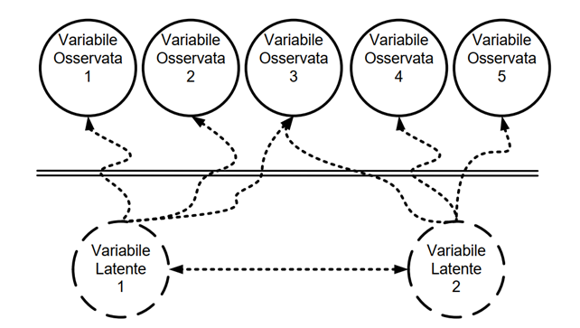
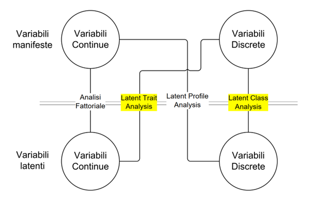

<!-- \frame[plain]{\titlepage}  -->

```{r setup, include=FALSE}
knitr::opts_chunk$set(echo = F, 
                      warning = F, 
                      message = F, 
                      fig.align = "center", 
                      out.width = "90%")
IRT <- function(theta, a = 1, b = 0, c = 0,e = 1) {
  y <- c + (e - c) * exp(a * (theta - b)) / (1 + exp(a * (theta - b)))
  y[is.na(y)] = 1
  return(y)
}

i_info <- function(b, a=1,c=0, theta = seq(-5,5,length.out=1000)){
 
P <- NULL 
Q <- NULL
Ii <- NULL
for(i in 1:1000){
  P[i] <- 1/(1+ exp (-a*(theta[i] - b)))
  Q[i]= 1-P[i]
  Ii[i] =(a*Q[i]*(P[i]-c)^2)/(P[i]*((1-c)^2)) # (3PL)
   }
return(Ii)
}
# Function to get all item information
item_info <- function(b,a=1, c= 0){
item <- NULL
  for(i in 1:length(b)){
  item[[i]] <- i_info(b[i],a[i])
  }
return(item)
}

set.seed(999)

theta = seq(-4,4,length.out=1000)
library(xtable)
library(sirt)
library(TAM)
```


# Introduzione

## Le variabili latenti 

### Cosa sono 

\vspace{5mm}

- Sono variabili \color{latenti} non direttamente osservabili \normalcolor $\rightarrow$ **\color{latenti} variabili latenti**

- Inferite a partire da indicatori \color{manifeste} direttamente  osservabili \normalcolor $\rightarrow$ **\color{manifeste} variabili manifeste**

- Importanza dell'operazionalizzazione del costrutto 


### Esempio 1

Osserviamo Giorgio e vediamo che Giorgio:

- ha tanti amici

- è contento quando ha tante persone intorno 

- cerca sempre di rimanere in contatto con le persone 

- partecipa a tanti eventi sociali 

- $\ldots$

I comportamenti di Giorgio (\color{manifeste}**variabili manifeste**\normalcolor) possono essere spiegati sulla base del costrutto latente ***\color{latenti}estroversione*** 

### Esempio 2

Osserviamo Alessandra e vediamo che Alessandra:

- è interessata a nuove culture

- prova volentieri cibi nuovi  

- è aperta alla possibilità di provare nuove esperienze

- è creativa 

- $\ldots$

I comportamenti di Alessandra (\color{manifeste}**variabili manifeste**\normalcolor) possono essere spiegati sulla base del costrutto latente ***\color{latenti}apertura all'esperienza*** 


## Modelli per variabili latenti 

### 

Modelli matematici che permettono di collegare le \color{latenti}variabili latenti\normalcolor con le \color{manifeste}variabili manifeste \normalcolor 

Assunzioni: 

- Le \color{latenti}variabili latenti \normalcolor sono la causa delle \color{manifeste}variabili manifeste \normalcolor 

- *Indipendenza locale*: Una volta presa in considerazione l'effetto della \color{latenti}variabile latente\normalcolor, la correlazione tra le \color{manifeste}variabili manifeste \normalcolor  svanisce

\vspace{3mm}

```{r echo = F, out.width="70%"}

```


### Diversi modelli per diverse variabili 

```{r out.width="80%", echo = F}

```

Modelli IRT e modello di Rasch $\rightarrow$ **Modelli di analisi per tratti latenti** 

# Item Respone Theory

## IRT vs. CTT

### 

Sia i modelli dell'IRT sia la Classical Test Theory (CTT) hanno come obiettivo la misurazione delle persone $\rightarrow$ stabilire la posizione delle persone sul tratto latente di interesse

::: columns

:::: column
\begin{center}
IRT
\end{center}

Focus $\rightarrow$ Gli item
::::

:::: column
\begin{center}
CTT
\end{center}

Focus $\rightarrow$ Il test
::::

:::


## L'idea di base 

### 

La probabilità di una risposta osservata (\color{manifeste}variabile manifesta\normalcolor) dipende sia dalle caratteristiche della \sbj{persona} sia dalle caratteristiche dell'\colit{item}

Le caratteristiche della \sbj{persona} sono descritte da un parametro relativo alla persona $\rightarrow$ \color{latenti} costrutto latente\normalcolor (e.g., intelligenza, autostima, estroversione, apertura all'esperienza ecc.)

Le caratteristiche dell'\colit{item} possono essere descritte da uno o più parametri, quali la \textbf{difficoltà}, la \textbf{discriminatività}, lo \textbf{pseudo guessing} e il \textbf{careless error}


### 


\begin{minipage}{.20\textwidth}
	\begin{figure}
				\centering
				\includegraphics[width=\linewidth]{img/lisa.png}
			\end{figure}

			\centering
			\sbj{$A_\text{Lisa}$}
			
\end{minipage}
\begin{minipage}{.25\textwidth}
\begin{center}
\textbf{Q1}

$3 + 2 = ?$

\colit{$d_{\text{Q1}}$}
\end{center}
\end{minipage}
\begin{minipage}{.25\textwidth}
\begin{center}
\textbf{Q1}

$3x - 2y + 4 = ?$

\colit{$d_{\text{Q2}}$}
\end{center}
\end{minipage}
\begin{minipage}{.20\textwidth}
	\begin{figure}
				\centering
				\includegraphics[width=\linewidth]{img/bart.png}
			\end{figure}

			\centering
			\sbj{$A_\text{Bart}$}
			
\end{minipage}

### Diversi modelli IRT 

A seconda: 

1. Tratto latente: 

  - modelli unidimensionali 
  - modello multidimensionali
  
2. Categorie di risposta: 

  - item dicotomici (due categorie di risposta, e.g., vero/falso, accordo/disaccordo)
  - item politomici (almeno 3 categorie di risposta, e.g., item con scala di risposta tipo Likert)
  
### Modelli per item dicotomici


Si distinguono in base al numerod parametri che descrivono le caratteristiche degli item: 

- modello logistico a un parametro (one-parameter logistic model; 1PL)

- modello logistico a due parametri (two-parameter logistic model; 2PL)

- modello logistico a tre parametri (three-parameter logistic model; 3PL)

- modello logistico a quattro parametri (four-parameter logistic model;
4PL; usato raramente)

### Caratteristiche generali 

- Parametro del soggetto e parametri degli item si trovano sullo stesso latente 

- Ad aumentare della distanza sul tratto latente tra i parametri degli item e il parametro del soggetto cambia la probabilità di rispondere correttamente

- Quando il parametro del soggetto e il parametro di difficoltà dell'item coincidono, la probabilità di risposta corretta è del 50% (questo è vero solo per 1PL e 2PL)

# 1PL


## Response function

###

La probabilità di rispondere correttamente (affermativamente) all'item $i$ da parte della persona $p$ è formalizzata come: 

$$P(x_{v1} = 1| \theta_p, b_i) = \dfrac{exp(\theta_p - b_i)}{exp(\theta_p - b_i)}$$
Dove: 

$\theta_p$: abilità della persona (i.e., livello di tratto posseduto dalla persona) $\rightarrow$ maggiore $\theta_v$, maggiore il livello di tratto di $v$
      
$b_i$; difficoltà dell'item $i$ o location dell'item sul tratto latente $\rightarrow$ maggiore $b_i$,più è difficile rispondere correttamente a $i$


## Item Charcteristic Curve 

###

```{r echo = F, out.width = "100%"}
par(mar = c(5,7,4,2) + 0.1) 
plot(theta, IRT(theta, b = 1, a = 1),
     cex.lab= 2.5, 
     cex.axis =1.5,
       xlab = expression(theta), ylab = "Probabilità di \n rispondere correttamente",
       xlim = c(-4, 4), ylim = c(0, 1), 
     type = "l", lwd = 3, 
     col = "royalblue")

mtext("b = 1", side = 1, at = 1, cex = 2, padj = 1)

segments(-7, 0.5, 
         1, 0.5, 
         col = "red", lty = 3, lwd = 3)
segments(1, -0.5, 
         1, 0.5, 
         col = "red", lty = 3, lwd = 3)
```

## Item Response Function

###

SI può ottenere una misura della precisione con cui ogni item misura determinate parti del tratto latente $\rightarrow$ \emph{Item Response Function}: 

$$I_I = P_i(\theta, b_i)Q_i(\theta, b_i)$$

dove $Q = 1- P_i(\theta_p, b_i)$ è la probabilità che di risposta errata all'item $i$

###

Valore massimo quando $\theta_v = b_i$ $\rightarrow$ in questo caso $P(x_{pi}=1) = P(x_{pi}=0) =0.50$ $\rightarrow$ $I_i = .25$

```{r}
b <- 1
a <- rep(1, length(b))
# Get all item information
c <- item_info(b,a)
Theta <- matrix(seq(-4,4, length.out=1000))
check <- data.frame(Theta, 
                    item_info = c[[1]])
d <- do.call('cbind',c)
sum_info1 <- rowSums(d)

plot(check$Theta, check$item_info, ylim= c(0, 1), cex.lab= 2, 
     cex.axis =1.5,
       xlab = expression(theta), ylab = "Informazione", 
     type = "l", lwd =2, 
     col = "royalblue")
segments(-7, 0.25, 
         1, 0.25, 
         col = "red", lty = 3, lwd = 3)
segments(1, -0.25, 
         1, 0.25, 
         col = "red", lty = 3, lwd = 3)

lines(theta, IRT(theta, b=1, 
                a = 1), 
      lty = 2, lwd=3, col = "grey")
```

### 

Qualsiasi item è più informativo per i soggetti con abilità uguale alla location dell'item $\rightarrow$ al crescere della distanza tra soggetto e item, cala l'informatività (i.e., precisione del soggetto)

Tanti soggetti con livelli diversi di abilità $\rightarrow$ item con livelli di difficoltà distribuiti lungo tutto il continuum latente 

::: columns

:::: column

\begin{center}
IRT
\end{center}

Meglio item con difficoltà diverse, sparpagliate lungo tutto il tratto latente
::::

:::: column
\begin{center}
CTT
\end{center}

Meglio item con difficoltà omogenee
::::


:::

### Item con diverse locations: ICC

\vspace*{-15mm}

```{r, out.width = "90%"}
b = seq(-2.5, 2.5, length = 5)
a = rep(1, length(b))

my_colors <- RColorBrewer::brewer.pal(6, "Blues")[2:6]

par(mar = c(5,7,4,2) + 0.1) 
plot(theta, IRT(theta, b = b[1], a = a[1]),
     cex.lab= 2.5, 
     cex.axis =1.5,
       xlab = expression(theta), ylab = "Probabilità di \n rispondere correttamente",
       xlim = c(-4, 4), ylim = c(0, 1), 
     type = "l", lwd = 3, 
     col = my_colors[1])
  
segments(-7, 0.5, 
         b[1], 0.5, 
         col = "red", lty = 3, lwd = 3)
segments(b[1], -0.5, 
         b[1], 0.5, 
         col = "red", lty = 3, lwd = 3)

si = data.frame(item1 = b[1], item2 = b[2], item3 = b[3], 
                item4 = b[4], item5 = b[5])
rownames(si) = "b"
text(x= -2, y = 0.8, colnames(si)[1], col = my_colors[1], cex = 2)


for ( i in 2:length(b)) {
  lines(theta, IRT(theta, b=b[i], 
                a = 1), 
      lty = 1, lwd=3, col = my_colors[i])
  segments(-7, 0.5, 
         b[i], 0.5, 
         col = "red", lty = 3, lwd = 3)
segments(b[i], -0.5, 
         b[i], 0.5, 
         col = "red", lty = 3, lwd = 3)
text(x= b[i] +.5, 
     y = 0.8, colnames(si)[i], col = my_colors[i], cex = 2)

}


```

\centering 

```{r results='asis'}
print(xtable(si), comment = FALSE, include.rownames=T)
```

### Item con diverse locations: IIF

\vspace*{-15mm}

```{r}
a <- rep(1, length(b))
# Get all item information
c <- item_info(b,a)
Theta <- matrix(seq(-4,4, length.out=1000))
check = data.frame(theta = Theta)
temp = NULL
for (i in 1:length(c)) {
  temp = cbind( temp, c[[i]])
}

check = cbind(check, temp)
colnames(check)[2:ncol(check)] = paste0("item_info", 1:(ncol(check)-1))

d <- do.call('cbind',c)
sum_info <- rowSums(d)

check$theta = NULL

plot(Theta, check[, 1], ylim= c(0, 1), cex.lab= 2, 
     cex.axis =1.5,
       xlab = expression(theta), ylab = "Informazione", 
     type = "l", lwd =2, 
     col = my_colors[1])
segments(-7, 0.25, 
         b[1], 0.25, 
         col = "red", lty = 3, lwd = 3)
segments(b[1], -0.25, 
         b[1], 0.25, 
         col = "red", lty = 3, lwd = 3)


text(x= -2, y = 0.4, colnames(si)[1], col = my_colors[1], cex = 2)


for ( i in 2:length(b)) {
  lines(theta, check[, i], 
      lty = 1, lwd=3, col = my_colors[i])
  segments(-7, 0.25, 
         b[i], 0.25, 
         col = "red", lty = 3, lwd = 3)
segments(b[i], -0.25, 
         b[i], 0.25, 
         col = "red", lty = 3, lwd = 3)
text(x= b[i] +.5, 
     y = 0.4, colnames(si)[i], col = my_colors[i], cex = 2)

}

for ( i in 2:length(b)) {
  lines(theta, IRT(theta, b=b[i], 
                a = 1), 
      lty = 1, lwd=2, col = "grey")
}


```

\centering 

```{r results='asis'}
print(xtable(si), comment = FALSE, include.rownames=T)
```

## Test Information Function

###

Restituisce una misura della precisione con cui il test misura complessivamente il tratto latente: 

$$I(\theta) = \sum I_i(\theta, b_i) = $$

La TIF permette di prevedere l’accuratezza con cui è
possibile misurare ogni livello di tratto latente

Simile al concetto di attendibilità in CTT

### 

<!-- \vspace*{-5mm} -->

```{r}
plot(theta, sum_info, cex.lab= 2, 
     cex.axis =1.5,
       xlab = expression(theta), ylab = "Informazione", 
     type = "l", lwd =2, 
     col = "black", ylim = c(0,1))

for ( i in 1:length(b)) {
  lines(theta, check[, i], 
      lty = 1, lwd=3, col = my_colors[i])
}
```
\centering 
\small
\vspace{-3mm}
```{r results='asis'}
print(xtable(si), comment = FALSE, include.rownames=T)
```


### Standard Error of Measrument (SEM)

Descrive la precisione della misurazione: 

$$SEM(\theta) = \sqrt{\dfrac{1}{I(\theta)}} = \sqrt{\dfrac{1}{P_i(\theta, b_i)Q_i(\theta, b_i)}} $$
Maggiore è l'informazione, minore è il SEM

Minore è l'informazione, maggiore è il SEM

A differenza della CTT, non si assume che l'errore di misura sia uguale per tutti i soggetti

### 

<!-- \vspace*{-5mm} -->

```{r}


par(mar = c(5, 4, 4, 4) + 0.3)  # Leave space for z axis
plot(theta, sqrt(1/sum_info), cex.lab= 2, 
     cex.axis =1.5,
       xlab = expression(theta), ylab = "SEM", 
     type = "l", lwd =2, 
     col = "firebrick")
par(new = TRUE)
plot(theta, sum_info, type = "l", axes = FALSE,
     bty = "n", xlab = "", ylab = "", ylim = c(0,1))

axis(side=4, at = pretty(range(sum_info)), cex = 1.5)
mtext("Informazione", side=4, line=3, cex = 2)

```

\centering 
\small
\vspace{-3mm}

```{r results='asis'}
print(xtable(si), comment = FALSE, include.rownames=T)
```

# 2PL

## Item Response Function

###

Viene inserito il parametro di discriminatività dell'item ($a_i$): 

$$P(x_{v1} = 1| \theta_p, b_i. a_i) = \dfrac{exp(a_i(\theta_p - b_i))}{1+exp(a_i(\theta_p - b_i))}$$
Dove: 

$\theta_p$: abilità della persona (i.e., livello di tratto posseduto dalla persona) $\rightarrow$ maggiore $\theta_v$, maggiore il livello di tratto di $v$
      
$b_i$; difficoltà dell'item $i$

$a_i$: capacità discriminativa o discriminatività dell'item $\rightarrow$  capacità dell’item i di discriminare
tra soggetti con livelli diversi di tratto (piccole differenze nel livello di tratto portano a grandi differenze nella probabilità di rispondere correttamente all’item)


### Ma che vuol dire?

\vspace*{-10mm}
\begin{overprint}
	
\onslide<1>

```{r}
library(png)
# lisa = readPNG(paste0(getwd(), "/intro/img/lisa.png"))
# bart =readPNG(paste0(getwd(), "/intro/img/bart.png"))

lisa = readPNG( "img/lisa.png")
bart = readPNG( "img/bart.png")

plot(theta, IRT(theta, a = 0.5, b = 1), 
     type = "l", 
     ylab = "P(x = 1)", ylim = c(0,1 ), cex.lab= 2, 
     cex.axis =1.5, xlab = expression(theta), lwd = 3)


rasterImage(lisa, 0.6, -0.10, 1.5, 0.15)
rasterImage(bart, -1.5, -0.10, -0.5, 0.15)

text(x= 3.2, 
     y = 0.95, expression(paste(a[1], "= 0.50")), 
     col = "black", cex = 2)


```

\begin{columns}[T]

\begin{column}{.50\linewidth}

Item 1 ($a_1 = 0.50$): 

$2 + 2= ?$
\end{column}

\begin{column}{.50\linewidth}

\end{column}

\end{columns}


\onslide<2>

```{r}
plot(theta, IRT(theta, a = 0.5, b = 0), 
     type = "l", 
     ylab = "P(x = 1)", ylim = c(0,1 ), cex.lab= 2, 
     cex.axis =1.5, xlab = expression(theta), lwd = 3)
text(x= 3.2, 
     y = 0.95, expression(paste(a[1], "= 0.50")), 
     col = "black", cex = 2)

segments(-7, exp(0.5 *(1))/(1+exp(0.5 *(1))), 
         1, exp(0.5 *(1))/(1+exp(0.5 *(1))), 
         col = "red", lty = 3, lwd = 3)
segments(1, -exp(0.5 *(1))/(1+exp(0.5 *(1))), 
        1, exp(0.5 *(1))/(1+exp(0.5 *(1))), 
         col = "red", lty = 3, lwd = 3)

segments(-7, exp(0.5 *(-1))/(1+exp(0.5 *(-1))), 
         -1, exp(0.5 *(-1))/(1+exp(0.5 *(-1))), 
         col = "royalblue4", lty = 3, lwd = 3)
segments(-1, -exp(0.5 *(-1))/(1+exp(0.5 *(-1))), 
        -1, exp(0.5 *(-1))/(1+exp(0.5 *(-1))), 
         col = "royalblue4", lty = 3, lwd = 3)
rasterImage(lisa, 0.6, -0.10, 1.5, 0.15)
rasterImage(bart, -1.5, -0.10, -0.5, 0.15)

```

\begin{columns}[T]

\begin{column}{.50\linewidth}

Item 1 ($a_1 = 0.50$): 

$2 + 2= ?$
\end{column}

\begin{column}{.50\linewidth}

\end{column}

\end{columns}


\onslide<3>

```{r}

plot(theta, IRT(theta, a = 0.5, b = 0), 
     type = "l", 
     ylab = "P(x = 1)", ylim = c(0,1 ), cex.lab= 2, 
     cex.axis =1.5, xlab = expression(theta), lwd = 3)
text(x= 3.2, 
     y = 0.95, expression(paste(a[1], "= 0.50")), 
     col = "black", cex = 2)

segments(-7, exp(0.5 *(1))/(1+exp(0.5 *(1))), 
         1, exp(0.5 *(1))/(1+exp(0.5 *(1))), 
         col = "red", lty = 3, lwd = 3)


segments(-7, exp(0.5 *(-1))/(1+exp(0.5 *(-1))), 
         -1, exp(0.5 *(-1))/(1+exp(0.5 *(-1))), 
         col = "royalblue4", lty = 3, lwd = 3)

 lines(theta, IRT(theta, a = 2.5, b = 0), 
      lty = 1, lwd=3, col = "springgreen")
text(x= -0.8, 
     y = 0.75, expression(paste(a[2], "= 2.50")), 
     col = "springgreen", cex = 2)

segments(-7, exp(2.5 *(1))/(1+exp(2.5 *(1))), 
         1, exp(2.5 *(1))/(1+exp(2.5 *(1))), 
         col = "red", lty = 3, lwd = 3)
segments(1, -exp(2.5 *(1))/(1+exp(2.5 *(1))), 
        1, exp(2.5 *(1))/(1+exp(2.5 *(1))), 
         col = "red", lty = 3, lwd = 3)

segments(-7, exp(2.5 *(-1))/(1+exp(2.5 *(-1))), 
         -1, exp(2.5 *(-1))/(1+exp(2.5 *(-1))), 
         col = "royalblue4", lty = 3, lwd = 3)
segments(-1, -exp(0.5 *(-1))/(1+exp(0.5 *(-1))), 
        -1, exp(0.5 *(-1))/(1+exp(0.5 *(-1))), 
         col = "royalblue4", lty = 3, lwd = 3)
rasterImage(lisa, 0.6, -0.10, 1.5, 0.15)
rasterImage(bart, -1.5, -0.10, -0.5, 0.15)


```
	
\begin{columns}[T]

\begin{column}{.50\linewidth}

Item 1 ($a_1 = 0.50$): 

$2 + 2= ?$
\end{column}

\begin{column}{.50\linewidth}

Item 2 ($a_2 = 2.50$): 

$5 + 14 = ?$

\end{column}

\end{columns}

	
\end{overprint}


### Discriminatività negativa

```{r}
plot(theta, IRT(theta, a = -0.5, b = 0), 
     type = "l", 
     ylab = "P(x = 1)", ylim = c(0,1 ), cex.lab= 2, 
     cex.axis =1.5, xlab = expression(theta), lwd = 3)
text(x= 3.2, 
     y = 0.95, expression(paste(a[1], "= -0.50")), 
     col = "black", cex = 2)

segments(-7, 0.5, 
         0, 0.5, 
         col = "red", lty = 3, lwd = 3)
segments(0, -0.5, 
        0, 0.5, 
         col = "red", lty = 3, lwd = 3)

```

Al crescere del tratto latente...la probabilità di rispondere correttamente diminuisce!

Questi item vengono scartati 


### 

```{r}
a = c(0.5, 0.9, 1.5, 1.5)
b = c(rep(0, (length(a) -1)), 2)

my_colors <- RColorBrewer::brewer.pal(6, "Blues")[2:6]
my_col = c(my_colors[1:2], my_colors[5], my_colors[5])

par(mar = c(5,7,4,2) + 0.1) 
plot(theta, IRT(theta, b = b[1], a = a[1]),
     cex.lab= 2.5, 
     cex.axis =1.5,
       xlab = expression(theta), ylab = "Probabilità di \n rispondere correttamente",
       xlim = c(-4, 4), ylim = c(0, 1), 
     type = "l", lwd = 3, 
     col = my_colors[1])
  
segments(-7, 0.5, 
         b[1], 0.5, 
         col = "red", lty = 3, lwd = 3)
segments(b[1], -0.5, 
         b[1], 0.5, 
         col = "red", lty = 3, lwd = 3)

si = data.frame(item1 = c(b[1], a[1]), 
                item2 = c(b[2], a[2]), 
                item3 = c(b[3], a[3]), 
                item4 = c(b[4], a[4]))
rownames(si) = c("b", "a")

text(x= -2, y = 0.3, colnames(si)[1], col = my_col[1], cex = 2)


for ( i in 2:length(b)) {
  lines(theta, IRT(theta, b=b[i], 
                a = a[i]), 
      lty = 1, lwd=3, col = my_col[i])
  segments(-7, 0.5, 
         b[i], 0.5, 
         col = "red", lty = 3, lwd = 3)
segments(b[i], -0.5, 
         b[i], 0.5, 
         col = "red", lty = 3, lwd = 3)


}

text(x= b[2] -.5, 
     y = 0.6,  colnames(si)[2], col = my_col[2], cex = 2)

text(x= b[3] +.7, 
     y = 0.8,  colnames(si)[3], col = my_col[3], cex = 2)
text(x= b[4] +.7, 
     y = 0.8,  colnames(si)[4], col = my_col[4], cex = 2)
```


## Item Information Function

###

$$I_i(\theta, b_i, a_i) = P_i(\theta, b_i, a_i)Q_i(\theta, b_i, a_i)$$

Dove $Q_i = 1 - P_i(\theta, b_i, a_i)$ è la probabilità di osservare una risposta errata 

### 

\vspace*{-5mm}

```{r}
a = c(0.5, 0.9, 1.5, 1.5)
b = c(rep(0, (length(a) -1)), 2)
# my_colors <- RColorBrewer::brewer.pal(6, "Blues")[2:6]

par(mar = c(5,7,4,2) + 0.1) 

si = data.frame(item1 = c(b[1], a[1]), 
                item2 = c(b[2], a[2]), 
                item3 = c(b[3], a[3]), 
                item4 = c(b[4], a[4]))
rownames(si) = c("b", "a")


c <- item_info(b,a)
Theta <- matrix(seq(-4,4, length.out=1000))
check = data.frame(theta = Theta)
temp = NULL
for (i in 1:length(c)) {
  temp = cbind( temp, c[[i]])
}

check = cbind(check, temp)
colnames(check)[2:ncol(check)] = paste0("item_info", 1:(ncol(check)-1))

d <- do.call('cbind',c)
sum_info <- rowSums(d)

check$theta = NULL

plot(Theta, check[, 1], ylim= c(0, 1), cex.lab= 2, 
     cex.axis =1.5,
       xlab = expression(theta), ylab = "Informazione", 
     type = "l", lwd =2, 
     col = my_col[1])


#text(x= -2, y = 0.4, colnames(si)[1], col = my_col[1], cex = 2)

for ( i in 2:length(b)) {
  lines(theta, check[, i], 
      lty = 1, lwd=3, col = my_col[i])


}

for ( i in 1:length(b)) {
  lines(theta, IRT(theta, b=b[i], 
                a = a[i]), 
      lty = 1, lwd=2, col = "grey")
}


# text(x= b[2] -.5, 
#      y = 0.4,  colnames(si)[2], col = my_colors[2], cex = 2)
# 
# text(x= b[3] +.1, 
#      y = 0.4,  colnames(si)[3], col = my_colors[3], cex = 2)
# text(x= b[4] +.7, 
#      y = 0.4,  colnames(si)[4], col = my_colors[4], cex = 2)
```

\vspace{-3mm}
\centering
\small

```{r results='asis'}
print(xtable(si), comment = F)
```


## Test Information Function

###

La TIF è la somma delle informatività dei singoli item

$$I(\theta) = \sum I_i(\theta, b_i, a_i) = $$

### 

\vspace*{-5mm}

```{r}
plot(theta, sum_info, cex.lab= 2, 
     cex.axis =1.5,
       xlab = expression(theta), ylab = "Informazione", 
     type = "l", lwd =2, 
     col = "black", ylim = c(0,1))

for ( i in 1:length(b)) {
  lines(theta, check[, i], 
      lty = 1, lwd=3, col = my_colors[i])
}
```

\centering 
\small
```{r results='asis'}
print(xtable(si), comment = FALSE, include.rownames=T)
```


### Standard Error of Measrument (SEM)

Reciproco della TIF: 

$$SEM(\theta) = \sqrt{\dfrac{1}{I(\theta)}} = \sqrt{\dfrac{1}{a^2 P_i(\theta, b_i)Q_i(\theta, b_i)}} $$

### 

<!-- \vspace*{-15mm} -->

```{r}

par(mar = c(5, 4, 4, 4) + 0.3)  # Leave space for z axis
plot(theta, sqrt(1/sum_info), cex.lab= 2, 
     cex.axis =1.5,
       xlab = expression(theta), ylab = "SEM", 
     type = "l", lwd =2, 
     col = "firebrick")
par(new = TRUE)
plot(theta, sum_info, type = "l", axes = FALSE,
     bty = "n", xlab = "", ylab = "", ylim = c(0,1))

axis(side=4, at = pretty(range(sum_info)), cex = 1.5)
mtext("Informazione", side=4, line=3, cex = 2)

```

\centering 
\small
\vspace{-3mm}
```{r results='asis'}
print(xtable(si), comment = FALSE, include.rownames=T)
```

# 3PL 

## Item Response Function

### 

Viene aggiunto un parametro ("pseudo-guessing", $c$, che sposta verso l'alto l'asintoto sinistro): 

$$P(x_{v1} = 1| \theta_p, b_i. a_i) = c_i + (1 - c_i) \dfrac{exp(a_i(\theta_p - b_i))}{1+exp(a_i(\theta_p - b_i))}$$


Dove: 

$\theta_p$: abilità della persona (i.e., livello di tratto posseduto dalla persona) $\rightarrow$ maggiore $\theta_v$, maggiore il livello di tratto di $v$
      
$b_i$; difficoltà dell'item $i$

$a_i$: discriminatività dell'item $i$

$c_i$: pseudo-guessing (o asintoto inferiore) dell’item $i$ $\rightarrow$ probabilità di una risposta corretta quando il livello di tratto latente si avvicina a $-\infty$


### Ma che vuol dire?

\vspace*{-10mm}
\small

Item characteristic curve di due item, uno con $b = 0$, $a = 1.4$ e $c = 0.2$ (item 1), l'altro con $b = 0$, $a = 1.4$ e $c = 0.3$ (item 2)

```{r, out.width="70%"}
b = c(0, 1)
a = c(1.4, 1.4)
g = c(0.20, 0.30)

plot(theta, IRT(theta, a = a[1], b = b[1], c= g[1]), 
     type = "l", 
     ylab = "P(x = 1)", ylim = c(0,1 ), cex.lab= 2, 
     cex.axis =1.5, 
     xlab = expression(theta), lwd = 3, col = my_colors[1])
text(x= 3.2, 
     y = 0.90, "item1", 
     col = my_colors[1], cex = 2)

abline(h = .20, lty = 2, lwd = 2, col = "red")
abline(h = .30, lty = 2, lwd = 2, col = "red")
lines(theta, IRT(theta, a = a[2], b = b[2], c= g[2]), 
     col = my_colors[5], lwd = 3)
text(x= -0.4, 
     y = 0.90, "item2", 
     col = my_colors[5], cex = 2)

```

La probabilità di una risposta corretta si approssima a $c$ (0.20 e 0.30) quando
il livello di tratto latente è basso

###

\small


```{r out.width="70%"}
b = c(0, 1)
a = c(1.4, 1.4)
g = c(0.20, 0.30)

plot(theta, IRT(theta, a = a[1], b = b[1], c= g[1]), 
     type = "l", 
     ylab = "P(x = 1)", ylim = c(0,1 ), cex.lab= 2, 
     cex.axis =1.5, 
     xlab = expression(theta), lwd = 3, col = my_colors[1])
text(x= 3.2, 
     y = 0.90, "item1", 
     col = my_colors[1], cex = 2)

abline(h = .20, lty = 2, lwd = 2, col = "red")
abline(h = .30, lty = 2, lwd = 2, col = "red")
lines(theta, IRT(theta, a = a[2], b = b[2], c= g[2]), 
     col = my_colors[5], lwd = 3)
text(x= -0.4, 
     y = 0.90, "item2", 
     col = my_colors[5], cex = 2)

```

La probabilità di una risposta corretta è $>0.50$ quando il livello di
tratto è ugaule alla difficoltà dell’item (in particolare, essa è $c + (1 - c)/2$)

### 

In item a risposta multipla, una soltanto delle quali è corretta, ci si aspetta che soggetti con livello di tratto molto basso possano provare ad indovinare la risposta corretta scegliendo a caso

Nel caso in cui ci siano $k$ alternative di risposta e che queste siano tutte
ugualmente plausibili, il valore del parametro $c$ dovrebbe avvicinarsi a $\dfrac{1}{k}$

ASSUNZIONE: Tutte le $k$ alternative sono equiprobabili


## Item Information Function

### 

Nel 3PL, l'item response function prende in considerazione anche il parametro di guessing 


$$I_i(\theta, b_i, a_i, c_i) = a^2 \dfrac{P_i(\theta, b_i, a_i, c_i)}{Q_i(\theta, b_i, a_i, c_i)} \left[\dfrac{P_i(\theta, b_i, a_i, c_i) -c_i}{1 -c_i}\right]$$


Più è alto il guessing, minore sarà l'informatività dell'item

 $Q_i = 1 - P_i(\theta, b_i, a_i, c_i)$ è la probabilità di osservare una risposta errata 

### 

```{r}
i_info <- function(b = 0, a=1,g=0, guessing = F, theta=seq(-4,4,length.out=1000)){
 
P <- NULL 
Q <- NULL
Ii <- NULL

for(i in 1:1000){
  P[i] <- g + (1 -g) * (exp(a *(theta[i] - b))/(1 + exp(a *(theta[i] - b))))
  Q[i]= 1-P[i]
  
  if (guessing == F) {
    Ii[i] = a^2 *P[i]*Q[i]
  } else {
    Ii[i] = a^2 *(Q[i]/P[i]) * ((P[i] - g)/(1-g))^2
  }
   }
return(Ii)
}

item_info <- function(b,a=1,g = 0, guessing = NULL){
item <- NULL
  for(i in 1:length(b)){
  item[[i]] <- i_info(b[i],a[i], g[i], guessing = guessing)
  }
return(item)
}

par(mar = c(5,7,4,2) + 0.1) 


si = data.frame(item1 = c(b[1], a[1], g[1]), 
                item2 = c(b[2], a[2], g[2]))
rownames(si) = c("b", "a", "c")


c <- item_info(b,a, g, guessing = T)
Theta <- matrix(seq(-4,4, length.out=1000))
check = data.frame(theta = Theta)
temp = NULL
for (i in 1:length(c)) {
  temp = cbind( temp, c[[i]])
}

check = cbind(check, temp)
colnames(check)[2:ncol(check)] = paste0("item_info", 1:(ncol(check)-1))

d <- do.call('cbind',c)
sum_info <- rowSums(d)


check$theta = NULL

plot(Theta, check[, 1], ylim= c(0, 1), cex.lab= 2, 
     cex.axis =1.5,
       xlab = expression(theta), ylab = "Informazione", 
     type = "l", lwd =2, 
     col = my_colors[1])

text(x= 0, y = 0.4, colnames(si)[1], col = my_colors[1], cex = 2)

for ( i in 2:length(b)) {
  lines(theta, check[, i], 
      lty = 1, lwd=3, col = my_colors[i])
}
text(x= 2, y = 0.2, colnames(si)[2], col = my_colors[2], cex = 2)


for ( i in 1:length(b)) {
  lines(theta, IRT(theta, b=b[i], 
                a = a[i], c=g[i]), 
      lty = 1, lwd=2, col = "grey")
}


```

\centering

```{r results='asis'}
print(xtable(si), comment = F)
```


## Test Information Function

###

La TIF è la somma delle informatività dei singoli item

$$I(\theta) = \sum I_i(\theta, b_i, a_i, c_i) = $$

### 

\vspace*{-15mm}

```{r}
plot(theta, sum_info, cex.lab= 2, 
     cex.axis =1.5,
       xlab = expression(theta), ylab = "Informazione", 
     type = "l", lwd =2, 
     col = "black", ylim = c(0,1))

for ( i in 1:length(b)) {
  lines(theta, check[, i], 
      lty = 1, lwd=3, col = my_colors[i])
}
```
\centering 

```{r results='asis'}
print(xtable(si), comment = FALSE)
```


### Standard Error of Measrument (SEM)

Reciproco della TIF: 

$$SEM(\theta) = \sqrt{\dfrac{1}{I(\theta)}} = \sqrt{\dfrac{1}{a^2 P_i(\theta, b_i, a_i, c_i)Q_i(\theta, b_i, a_i, c_i)}} $$

### 

\vspace*{-15mm}

```{r}

par(mar = c(5, 4, 4, 4) + 0.3)  # Leave space for z axis
plot(theta, sqrt(1/sum_info), cex.lab= 2, 
     cex.axis =1.5,
       xlab = expression(theta), ylab = "SEM", 
     type = "l", lwd =2, 
     col = "firebrick")
par(new = TRUE)
plot(theta, sum_info, type = "l", axes = FALSE,
     bty = "n", xlab = "", ylab = "", ylim = c(0,1))

axis(side=4, at = pretty(range(sum_info)), cex = 1.5)
mtext("Informazione", side=4, line=3, cex = 2)

```

\centering 

```{r results='asis'}
print(xtable(si), comment = FALSE, include.rownames=T)
```


# 4PL

## Item Response Function

### 

Veramente poco usato

Prende in considerazione l'errore di distrazione (\textbf{careless error}) compiuto da persone con un livello molto alto di tratto: 

$$P(x_{v1} = 1| \theta_p, b_i. a_i) = c_i + (d_i - c_i) \dfrac{exp(a_i(\theta_p - b_i))}{1+exp(a_i(\theta_p - b_i))}$$
Dove: 

$\theta_v$: livello di tratto latente della persona

$b_i$,$a_i$, $c_i$; difficoltà, discriminatività e pseduo-guessing dell'item $i$

$d_i$: careless-error, probabilità di una risposta corretta (o affermativa) quando il livello di
tratto latente si avvicina a $+ \infty$

Minore è il valore di $d_i$, minore è la probabilità che un soggetto con un alto livello di tratto risponda correttamente (o affermativamente) all’item $i

###

```{r}
b = rep(0, 2)
a = c(1.4, 1.4)
g = c(0.20, 0.30)
d = c(.9, .7)

plot(theta, IRT(theta, a = a[1], b = b[1], c= g[1], e = d[1]), 
     type = "l", 
     ylab = "P(x = 1)", ylim = c(0,1 ), cex.lab= 2, 
     cex.axis =1.5, 
     xlab = expression(theta), lwd = 3, col = my_colors[1])
text(x= 3.2, 
     y = 0.80, "item1", 
     col = my_colors[1], cex = 2)

abline(h = .90, lty = 2, lwd = 2, col = "red")
abline(h = .70, lty = 2, lwd = 2, col = "red")
abline(h = .20, lty = 2, lwd = 2, col = "red")
abline(h = .30, lty = 2, lwd = 2, col = "red")
lines(theta, IRT(theta, a = a[2], b = b[2], c= g[2], e = d[2]), 
     col = my_colors[5], lwd = 3)
text(x= -0.4, 
     y = 0.90, "item2", 
     col = my_colors[5], cex = 2)
```


# Relazione tra i modelli considerati


### 

- Vincolando i parametri $d_i$ di tutti gli item $i$ ad essere uguali a 1, si passa dal modello 4PL al modello 3PL

- Vincolando i parametri $c_i$ di tutti gli item $i$ ad essere uguali a 0, si passa dal modello 3PL al modello 2PL

- Vincolando i parametri $a_i$ di tutti gli item $i$ ad essere uguali a 1, si passa dal modello 2PL al modello 1PL

### e il modello di Rasch? 

Formalmente, il modelli di Rasch è equivalente all'1PL, ma cambia la filosofia che c'è dietro.

::: columns

:::: column

\begin{center}
\high{IRT}


\end{center}
\high{adattamento del \textbf{modello} ai dati} 

Si seleziona il modello migliore per i dati
::::

:::: column
\begin{center}
\high{Rasch}
\end{center}

\high{adattamento dei \textbf{dati} al modello} 

Si cambiano i dati (e.g., si eliminano gli item che non fittano) per farli stare nel modello

\vspace{5mm}

```{r fig.align='right', out.width="50%"}

```

:::


:::

## Ma... quale modello?

Il modello può essere scelto: 

- A priori: 

  - considerazioni di natura teorica 
  - caratteristiche degli item stessi

- A posteriori: 
  
  - Si stimano tutti i modelli IRT sui dati 
  - Si confrontano e il modello che fitta meglio è il modello scelto


### A posteriori 

Per la verifica a posteriori, vanno considerati gli indici di fit comparativi: 

- $-$\emph{2loglikelihood}: da usare solo per modelli nested

- Akaike's Information Criterion (AIC)

- Bayesian Information Criterion (BIC)

La scelta migliore è considerarli sempre tutti insieme (quando si hanno modelli nested)

### $-$\emph{2loglikelihood}

Per intepretare la $-$\emph{2loglikelihood}, va calcolata la differenza tra la $-$\emph{2loglikelihood} di due modelli nested e la differenza tra i gradi di libertà dei due modelli nested

Si calcola la probabilità associata alla differenza tra la $-$\emph{2loglikelihood} dei due modelli secondo una distribuzione $\chi^2$ con gradi di libertà uguali alla differenza tra i gradi di libertà dei due modelli: 

- differenza significativa: Si sceglie il modello più complesso 

- differenza non significativa: Si sceglie il modello più parsimonioso

### Indici di entropia

AIC e BIC sono indici di entropia $\rightarrow$ va scelto il modello che presenta il valore di AIC/BIC \textbf{più basso} 

L'AIC penalizza i modelli più complessi indipendentemente dall'ampiezza campionaria 

Il BIC penalizza i modelli più complessi tenendo conto dell'ampiezza campionaria $\rightarrow$ particolarmente conservativo su campioni piccoli
